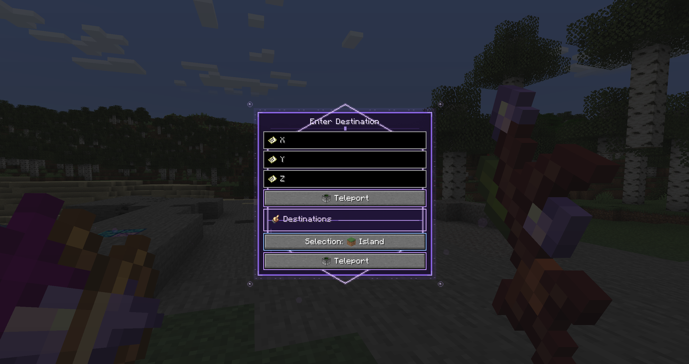

# Manifestation

Manifestation is a Fabric companion mod for Hex Casting.
Current release version: 2.0.0.

Usage details and pattern reference documentation are available on the docs site.

## Example



Example menu built using inputs, sections and buttons. Executes a teleport to a predetermined destination or allows for custom X,Y,Z co-ordinates.

## Documentation

- Start here: [Docs Home](https://withgallantry.github.io/HexManifestation/)
- Pattern reference: [patterns.html](https://withgallantry.github.io/HexManifestation/patterns.html)
- Pattern scribe: [hex-pattern-scribe.html](https://withgallantry.github.io/HexManifestation/hex-pattern-scribe.html)

## Build

```sh
./gradlew build
```

The built jar is written to `build/libs/`.

## Config

Server config is in `config/manifestation.json`.

- `intentRelayMaxRangeBlocks`: max link distance in blocks (`-1` means unlimited).
- `intentRelayCooldownTicks`: cooldown between successful trigger activations.
- `intentRelayStepTriggerEnabled`: enables floor-mounted "step on" activation for players.
